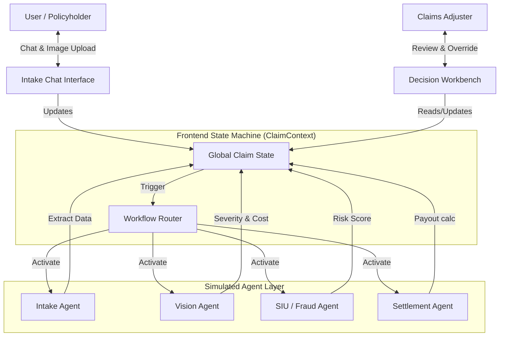

# Architecture & Data Flow

## High-Level Overview
The **Claims Agent OS** is a client-side Single Page Application (SPA) built with **React** and **TypeScript**. It simulates a complex, multi-agent backend architecture using a centralized state machine (`ClaimContext`) to orchestrate agent behaviors, data extraction, and workflow transitions.



## Core Components

### 1. The Brain: `ClaimContext` (State Management)
*   **Role**: Acts as the "backend" and database. It holds the single source of truth for the claim (`ClaimData`), including policy info, chat logs, and analysis results.
*   **Logic**:
    *   `addChatMessage()`: Appends messages and triggers simulated agent typing.
    *   `updateAgentStatus()`: Tracks the lifecycle of each agent (Waiting → Running → Completed/Failed).
    *   `updateStatus()`: Controls the overall claim lifecycle (Intake → Analyzing → Approved/Review).

### 2. Agent Workflow (The "Agentic" Logic)
The simulated agents run in a specific sequence, orchestrated by the `ScenarioController`:

1.  **Intake Agent (FNOL)**
    *   **Input**: User chat messages.
    *   **Process**: "NLP" simulation to extract date, location, and description.
    *   **Output**: Updates `claim.extractedData`.

2.  **Vision Agent (Investigation)**
    *   **Input**: Uploaded image URL.
    *   **Process**: Simulates Computer Vision analysis with artificial latency.
    *   **Output**: `severityScore` (0.0-1.0), `damageSeverity` (Minor/Severe), and `estimatedRepairCost`.

3.  **SIU Agent (Fraud Detection)**
    *   **Input**: Claim metadata (Location, Weather, History).
    *   **Process**: Cross-references data points.
    *   **Output**: `fraudRiskScore` and specific flags (e.g., `gpsMatch: false`).

4.  **Router / Adjudication Logic**
    *   **Rule**: `IF (fraudScore < 0.4 AND severityScore < 0.5) THEN Auto-Approve ELSE Escalate`.
    *   **Output**: Updates `claim.status` to `approved` or `review_required`.

5.  **Settlement Agent**
    *   **Input**: `estimatedRepairCost` and `policy.deductible`.
    *   **Process**: Math calculation (`Cost - Deductible`).
    *   **Output**: `recommendedPayout`.

### 3. The Interface (Dual-View)
*   **Left Panel (`CaseFileLeftPanel`)**:
    *   **Target User**: Policyholder (via Chat) & Adjuster (viewing transcripts).
    *   **Tech**: `framer-motion` for chat bubbles, dynamic list rendering for evidence.
*   **Right Panel (`AIReasoningPanel`)**:
    *   **Target User**: Adjuster (B2B).
    *   **Tech**: Collapsible cards, progress bars for confidence scores, conditional rendering for "Human-in-the-Loop" inputs.

## Data Model (`types/index.ts`)
The data structure is designed to be extensible for a real backend:

```typescript
interface ClaimData {
  id: string;
  status: 'intake' | 'approved' | 'review_required';
  policy: PolicyContext; // Limits, Deductibles
  chatHistory: ChatMessage[]; // Full conversation transcript
  analysis: {
    severityScore: number;
    fraudRiskScore: number;
    recommendedPayout: number;
    // ... explainability factors
  };
}
```

## Tech Stack
*   **Framework**: React 18 (Vite)
*   **Language**: TypeScript
*   **Styling**: Tailwind CSS (Utility-first, Enterprise theme)
*   **Icons**: Lucide React
*   **Animation**: Framer Motion (Critical for "Agentic Vibe")
*   **Navigation**: React Router DOM

